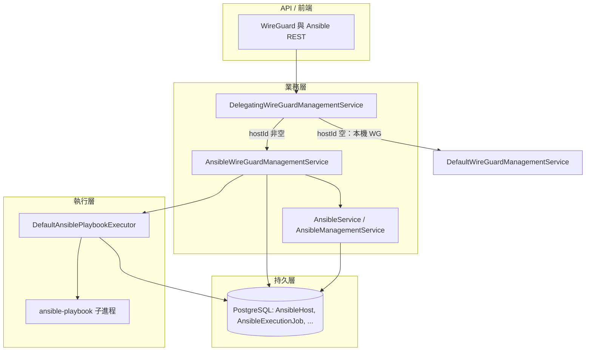
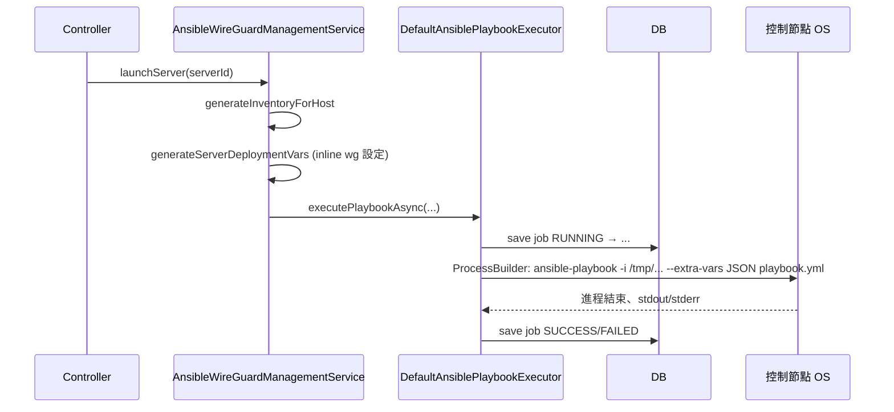

# Ansible 底層運作與控制面整合說明

本文說明 **wg-control-plane 應用程式內部** 如何驅動 Ansible：從 REST / 服務層到實際執行 `ansible-playbook` 進程的資料流、執行模式與設定。  
若你關心的是 **inventory / group_vars 概念與手動執行方式**，請見 [ansible-user-guide.md](./ansible-user-guide.md)；若關心 **各 playbook 的職責邊界**，請見 [ansible-playbooks-spec.md](./ansible-playbooks-spec.md)。

---

## 1. 為什麼會覺得「複雜」？

Ansible 在本專案裡同時扮演兩種角色：

| 角色 | 說明 |
|------|------|
| **部署工具（與官方一致）** | 目標機上仍由 **Ansible core** 透過 SSH 執行 module；語意與你在終端機跑 `ansible-playbook` 相同。 |
| **被應用程式「程式化呼叫」** | 控制面 **不嵌入** Ansible Python API，而是用 **Java `ProcessBuilder`** 在 **執行 wg-control-plane 的那台機器（控制節點）** 上啟動 `ansible-playbook` 子進程，並把 stdout/stderr、離開碼寫進資料庫。 |

因此心智模型是：**資料庫裡的 AnsibleHost + WireGuard 狀態 → Kotlin 組出 inventory 字串與 extra-vars → 子進程跑 playbook → 結果回寫 AnsibleExecutionJob**。

---

## 2. 整體架構（三層）

- **路由**：`WireGuardServer.hostId != null` 時，該伺服器由 **Ansible** 路徑管理（`DelegatingWireGuardManagementService` 轉發至 `AnsibleWireGuardManagementService`）。
- **執行**：真正碰 Ansible 的只有 **`AnsiblePlaybookExecutor` 的實作**（`DefaultAnsiblePlaybookExecutor`）。

---

## 3. 核心類別職責

| 元件 | 職責 |
|------|------|
| `AnsiblePlaybookExecutor` | 介面：同步 / 非同步執行 playbook、查詢 job、取消、重試、簡單統計。 |
| `DefaultAnsiblePlaybookExecutor` | 建立 `AnsibleExecutionJob`、組 `ansible-playbook` 命令列、寫暫存 inventory、執行進程、更新 DB。 |
| `AnsibleWireGuardManagementService` | WireGuard 網域邏輯：依 `AnsibleHost` 產生 **單機 inventory**（群組 `wireguard_servers`）、`generateServerDeploymentVars` 等 **extra-vars**，並選擇要跑哪個 playbook。 |
| `AnsibleService` / `AnsibleManagementService` | CRUD **AnsibleHost**、inventory group、（可選）產生較大型 inventory 檔供維運使用；與「單次 WG 操作」的動態 inventory 互補。 |
| `AnsibleExecutionJob` | JPA 實體：一次 playbook 執行的狀態、參數快照、stdout/stderr、離開碼。 |

---

## 4. 從「按啟動」到「ansible-playbook」：序列概覽

以下以 **啟動遠端 WG 伺服器**（`launchServer` → `wireguard-server-launch.yml`）為例：

重點：

1. **Inventory 是字串**：執行時寫成 **暫存 `.ini` 檔**，不是一定要先落在 `ansible/inventory/`。
2. **變數以 JSON 傳入**：`--extra-vars` 使用 Jackson 將 `Map<String, Any>` 序列化；playbook 裡的 `hosts: "{{ wg_target_hosts }}"` 必須與 inventory 群組名一致（程式內常數為 `wireguard_servers`）。
3. **Playbook 路徑**：預設相對於 **Ansible 工作目錄**（見下節）。

---

## 5. `DefaultAnsiblePlaybookExecutor` 如何組命令

1. **工作目錄 `getAnsibleDirectory()`**  
   - 若設定 **`ansible.working-directory`**：使用該檔案系統路徑。  
   - 否則：使用 classpath 下的 **`ansible/`**（即 `src/main/resources/ansible/` 打包後的 URI；與 JAR 同捆）。

2. **可執行檔**  
   - 預設 **`ansible.executable`** = `ansible-playbook`（需在 **PATH** 上）。  
   - 控制節點必須已安裝 Ansible，這點與手動操作一致。

3. **典型命令形狀**（概念上）  
   `ansible-playbook -i <temp-inventory.ini> [--extra-vars <json>] [-vvv...] <working-dir>/<playbook.yml>`

4. **環境變數**  
   - 設定 `ANSIBLE_HOST_KEY_CHECKING=False`，避免首次 SSH 互動卡住（與常見 lab 設定一致）。

5. **逾時**  
   - **`ansible.timeout-seconds`**（預設 3600）用於 `Process.waitFor`；逾時會強制結束進程並拋錯。

6. **取消**  
   - 執行中的 `Process` 會放在 `ConcurrentHashMap<UUID, Process>`，`cancelExecution` 可 `destroyForcibly()`。

---

## 6. 同步與非同步執行

| 方法 | 行為 | 典型用途 |
|------|------|----------|
| `executePlaybook(...)` | 在呼叫執行緒內 **阻塞** 直到 playbook 結束（或逾時）。 | 驗證連線、狀態檢查、必須等結果才能回傳錯誤給使用者的操作。 |
| `executePlaybookAsync(...)` | 以 **`@Async`** 在 Spring 非同步執行緒執行同一套 `executeJobSync`（介面宣告為無回傳值，避免 Spring 對 `@Async` 回傳型別的限制）。 | **啟動 / 停止** 遠端伺服器等長時間工作，API 可立即返回。 |

呼叫非同步後，若要追蹤結果，請用 **`AnsibleExecutionJob`** 的 id 查詢 **`/api/private/ansible/execution-jobs/{id}`**（或資料庫）。

---

## 7. `AnsibleExecutionJob` 生命週期

| 狀態 | 說明 |
|------|------|
| `PENDING` | 實體建立初期（若實作有先 persist）。 |
| `RUNNING` | `markAsStarted()` 後，ansible-playbook 執行中。 |
| `SUCCESS` / `FAILED` | playbook 離開碼 0 / 非 0，或例外經 catch 標記失敗。 |
| `CANCELLED` | 被取消。 |

表中欄位包含 **inventory 與 extra-vars 的快照**（JSON），便於稽核與重試（`retryExecution` 走 **同步** `executePlaybook`）。

---

## 8. WireGuard 操作與 playbook 對照（程式碼路徑）

以下為 `AnsibleWireGuardManagementService` 中 **實際呼叫的 playbook 檔名**（皆相對於 Ansible 工作目錄）：

| 操作 | Playbook |
|------|----------|
| 安裝套件 + 部署伺服器設定 | `wireguard-server-launch.yml` |
| 僅重載伺服器設定（含同角色 `wg_deploy`） | `wireguard-deploy-config.yml` |
| 停止 | `wireguard-stop.yml` |
| 驗證 `wg show` / 監聽埠 | `wireguard-verify.yml` |
| 遠端 client 設定 | `wireguard-client-deploy.yml` |
| 遠端 client 清理 | `wireguard-client-cleanup.yml` |

角色 **`wg_install` / `wg_deploy` / `wg_verify` / `wg_stop`** 等實作細節見各 `roles/`；部署後是否 **`systemd` 或 `wg-quick` CLI** 依角色內邏輯與目標 OS 而定（例如 Alpine 常無 systemd）。

---

## 9. 與「純手動 Ansible」的差異整理

| 項目 | 手動 | wg-control-plane |
|------|------|------------------|
| Inventory | 你維護檔案或目錄 | 由 DB 的 `AnsibleHost` **動態組字串** |
| 變數 | `-e` 或 group_vars | **`--extra-vars` JSON** 由 Kotlin 組出 |
| 結果 | 看終端機 | **寫入 `ansible_execution_jobs`** |
| 執行機器 | 你的筆電 / CI | **跑應用程式的那台機器** 必須能 SSH 到目標 |

---

## 10. 設定參數（應用程式）

透過 `@Value` 注入（可在 `application.yaml` 或環境變數覆寫）：

| 屬性 | 預設 | 意義 |
|------|------|------|
| `ansible.working-directory` | 未設（用 classpath `ansible/`） | Playbook 與 roles 的根目錄 |
| `ansible.timeout-seconds` | `3600` | 單次 `ansible-playbook` 等待上限 |
| `ansible.executable` | `ansible-playbook` | 可執行檔名稱或絕對路徑 |

---

## 11. 相關 REST 端點（摘錄）

| 路徑 | 說明 |
|------|------|
| `/api/private/ansible/...` | Ansible 主機、群組、inventory 檔等管理（見 `AnsibleController`）。 |
| `/api/private/ansible/execution-jobs` | 執行歷史列表與單筆詳情（`AnsibleExecutionJobController`）。 |
| `/api/private/wireguard/...` | WireGuard 伺服器 / 客戶端；含 **Ansible 託管** 時會觸發上述執行器。 |

---

## 12. 疑難排解方向（與底層有關）

1. **Playbook 找不到**：檢查 `ansible.working-directory` 或 JAR 內是否含 `src/main/resources/ansible/<檔名>.yml`。  
2. **`ansible-playbook: command not found`**：控制節點未安裝 Ansible 或 PATH 未設定。  
3. **SSH 失敗**：inventory 內 `ansible_host` / `ansible_user` / 埠號是否與 `AnsibleHost` 一致；金鑰是否在目標環境可用（若你有使用 private key 檔路徑變數）。  
4. **目標為 Alpine**：需 `wireguard-tools`、TUN/權限；且可能 **沒有 systemd**——角色需走 `wg-quick` 等路徑（見 `wg_deploy` 等實作）。

---

## 13. 延伸閱讀

- [ansible-user-guide.md](./ansible-user-guide.md) — inventory、`wg_target_hosts`、變數優先順序  
- [ansible-playbooks-spec.md](./ansible-playbooks-spec.md) — 各 playbook 的預期行為與邊界  
- 原始碼入口：`com.app.service.ansible.DefaultAnsiblePlaybookExecutor`、`com.app.service.AnsibleWireGuardManagementService`
